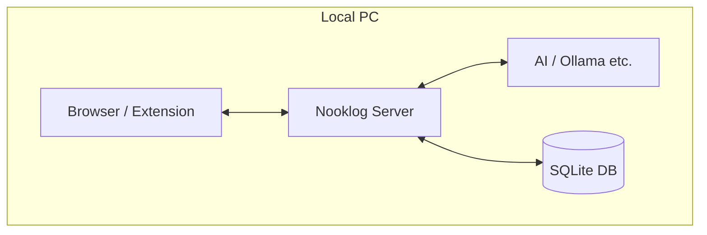
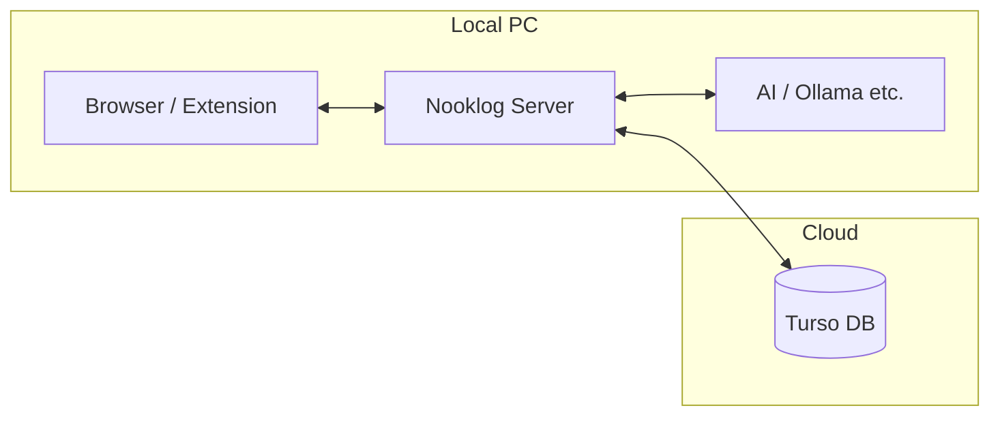
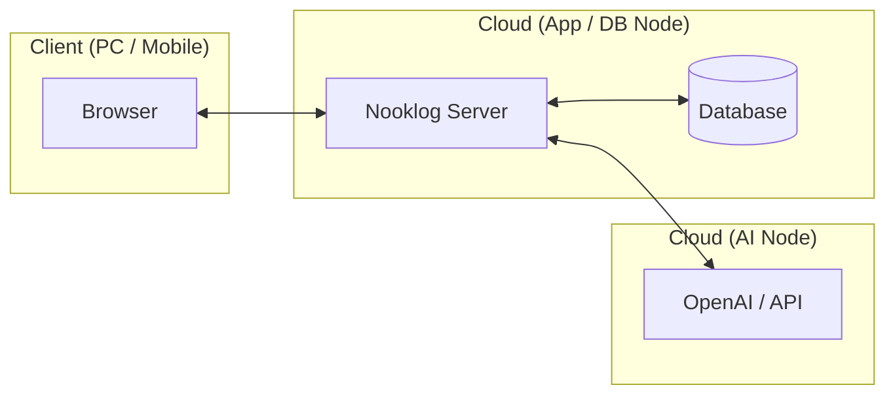

[🇯🇵](SKILL_ja.md)

## Client (Extension) Installation

Install the Nooklog extension that runs in your browser.

- Open **Extensions** > **Manage Extensions** from the Chrome menu (or go to `chrome://extensions`).
- Enable **Developer mode** in the top-right corner.
- Click the **Load unpacked** button.
- Select the `tool/browser-extension` folder within the repository.

Once installed, the Nooklog icon will appear in your browser toolbar. \
Click the icon and register your server URL (default: `http://localhost:5050`) to complete the setup.

## System Configuration

Nooklog consists of two components: the Browser Extension (Client) and the Nooklog Server. \
You can choose where each component runs (Local PC or Cloud) based on your needs.

### Configuration Patterns

| Component | [1] Full Local | [2] Cloud Sync | [3] Full Cloud |
| :--- | :---: | :---: | :---: |
| **App Runtime** | Local PC | Local PC | Cloud (Remote) |
| **AI (Embedding)** | Local PC | Local PC | Cloud (Remote) |
| **Database** | Local (Built-in) | **Cloud (Turso)** | **Cloud (Remote)** |

---

#### 1. Full Local
For users who want everything on a single PC. Simplest and fastest setup.


- **References**: See **A2. pm2** or **A3. Docker**.

#### 2. Cloud Sync (Sync between devices)
For users who want to share data across multiple PCs. Only the database is hosted in the cloud.


- **References**: Set up a local server and then follow **B1. Cloud Database (Turso)**.

#### 3. Full Cloud
For users who want to run everything in the cloud to reduce local PC load.


- **References**: Follow **A4. Self-hosting**, **B1. Cloud Database**, and **C1. LLM Server**.
----

## Server Component Installation

Combine the following components based on your chosen configuration.

- **[A] Server Runtime** (Choose one)
  - A1. npm start (Quick test)
  - A2. pm2 (Recommended / Background)
  - A3. Docker (Isolated environment)
  - A4. Self-hosting (Cloud / Northflank)
- **[B] Database Integration** (Optional)
  - B1. Cloud Database (Turso)
- **[C] AI Integration** (For vector search)
  - C1. LLM Server (OpenAI Compatible / Ollama etc.)

### Requirements

- **Node.js**: v22.0.0 or higher
- **RAM**: 80MB+ (Basic browsing. More recommended for indexing)
- **OS**: Windows, macOS, Linux (Docker supported)

### Environment Variables
Nooklog works with default settings, but you can customize it via a `.env` file (copied from `.env.sample`) or environment variables.

```bash
# Mac / Linux (Bash)
export PORT=5050 # Server port
export NOOKLOG_DATA_PATH=./data # Data storage path
```

```batch
# Windows (Command Prompt)
set NOOKLOG_DATA_PATH=./data # Data storage path
```

```powershell
# Windows (PowerShell)
$env:NOOKLOG_DATA_PATH = "./data" # Data storage path
```

### A1. npm start
Best for quick testing.

```bash
# Installation
git clone https://github.com/quoposk/nooklog.git
cd nooklog
npm install --omit=dev

# Optional: Configuration
cp .env.sample .env

# Start
npm start
```
Access `http://localhost:5050` once the server is running.

### A2. pm2
PM2 is a process manager for Node.js. It allows you to run Nooklog in the background and auto-start on boot.

```bash
# Install PM2 (if not installed)
npm install pm2 -g

# Start in background
npm run pm2:start

# Manage process
pm2 stop nooklog # Stop
pm2 logs nooklog # Show logs
```

Auto-start on Windows:
- Run `shell:startup` and place a shortcut to a batch file running `pm2 resurrect`.

Auto-start on macOS / Linux:
- Run `pm2 startup`, execute the provided command, then run `pm2 save`.

### A3. Docker
Ideal for running Nooklog in an isolated environment.

```bash
# Pull and Run
docker pull quoposk/nooklog:latest
docker run -d \
  -p 5050:5050 \
  -e NOOKLOG_PASSWORD=your-password \
  -v ~/.nooklog/data:/app/data \
  --name nooklog \
  quoposk/nooklog:latest
```
Note: On Windows CMD, use `-v %USERPROFILE%/.nooklog/data:/app/data`.

### A4. Self-hosting (Northflank)
Northflank is a PaaS for deploying applications. You can run Nooklog for free using their sandbox projects (as of April 2026).

By using Turso as a remote database, you can run Nooklog without a persistent volume (using only local cache).
(Alternatively, you can use a persistent disk volume to store the DB within the container.)

Similar services like Koyeb, Fly.io, Railway, Zeabur, and Render are also confirmed to work.

> [!CAUTION]
> If running on a public server, always set a strong `NOOKLOG_PASSWORD`.

#### Deployment via Web UI
- **Project**: Create a new project.
- **Service**: Create a "Deployment Service".
- **Source**: Select "External Image" and use `quoposk/nooklog:latest`.
- **Environment**: Add `NOOKLOG_PASSWORD` and Turso connection info.
- **Networking**: Exposed port `5050` via HTTP.

### B1. Cloud Database (Turso)
Turso is a distributed SQLite service. It allows you to sync your bookmarks across multiple devices.

```bash
# Set credentials in your environment or .env
TURSO_DATABASE_URL=libsql://your-db-name-user.turso.io
TURSO_AUTH_TOKEN=your-auth-token
```

Enable Local Replication (Embedded Replica) to sync your local cache with the cloud. \
This allows you to enjoy cloud sync while maintaining local-speed performance and offline support! ✨

```bash
TURSO_REPLICA=true
```

To upload an existing local database to Turso:
```bash
turso db create nooklog --from-file ./nooklog.db
```

### C1. LLM Server (OpenAI Compatible)
Nooklog is tested with Ollama, LM Studio, and llama-server. \
To enable vector search, you need an **Embedding Model** that fits your content and hardware.

Check the [MTEB Leaderboard](https://huggingface.co/spaces/mteb/leaderboard) for model performance, focusing on the **Retrieval** score.

#### Recommended Embedding Models

```bash
# Lightweight & High performance
ollama pull embeddinggemma:300m
# State-of-the-art balance
ollama pull qwen3-embedding:0.6b
# Multilingual support
ollama pull leoipulsar/harrier-0.6b
```

> [!INFO]
> **Why we use external LLM servers instead of node-llama-cpp**
> While `node-llama-cpp` can be faster, we chose external servers for the following reasons:
> - High memory usage (~1.6GB) during idling.
> - Lack of auto-unload functionality for models.
> - Inability to share the same model across multiple apps.
> - Increased container image size and build complexity.
