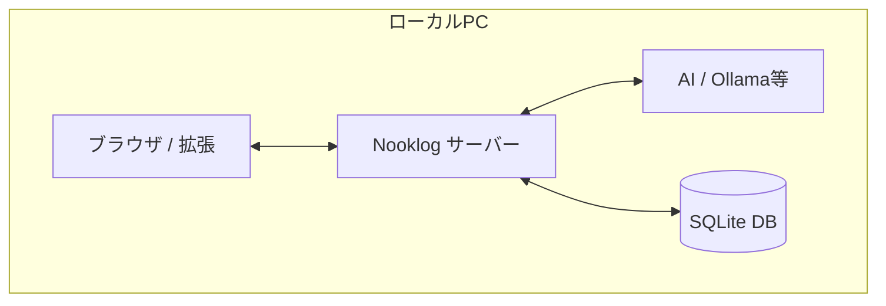
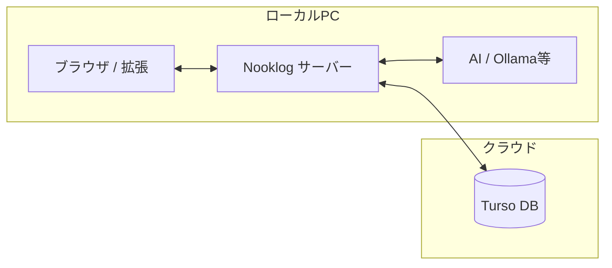
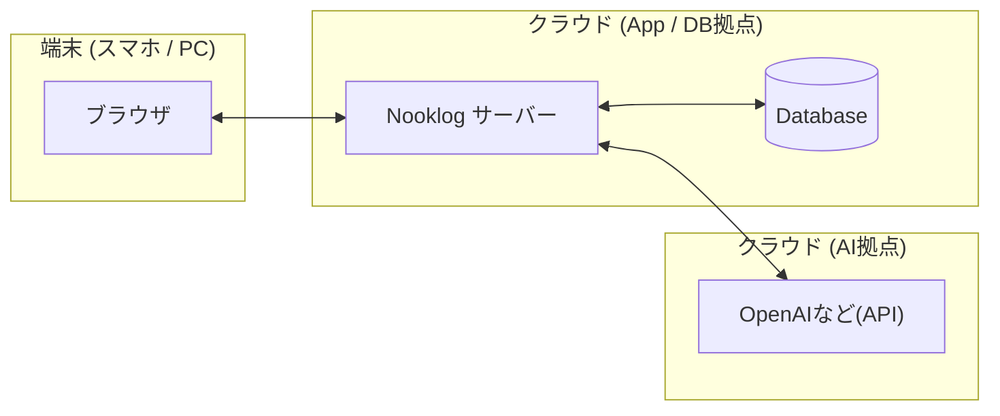

[🇺🇸](SKILL.md)

## クライアント(拡張機能)のインストール

ブラウザ(Chrome)で動作する Nooklog拡張機能をインストールします。 \

- Chromeのメニューから 「拡張機能」 > 「拡張機能を管理」 を開きます（chrome://extensions）。
- 右上の 「デベロッパー モード」 をONにしてください。
- 「パッケージ化されていない拡張機能を読み込む」 ボタンを押します。
- リポジトリ内の `tool/browser-extension` フォルダを選択します。

これで ブラウザに Nooklogのアイコンが表示されます。 \
アイコンをクリックして サーバーのURL（初期値は http://localhost:5050 ）を登録すれば 完了です。 \

## システム構成

Nooklogは ブラウザ拡張機能（クライアント）と データを管理するサーバーコンポーネントの2つで構成されます。\
利用シーンに合わせて 各コンポーネントをどこで動かすか（ローカルPCか クラウドか）を選択できます。\
これらの構成は 後から自由に変更することができます。 \
最初は お試しでローカルで試し 実用性が十分に確認できたら リモートへ移行する なども 可能です。

### 構成パターン比較

| 構成要素 | [1] フルローカル | [2] クラウド同期 | [3] フルクラウド |
| :--- | :---: | :---: | :---: |
| **アプリ実行環境** | ローカルPC | ローカルPC | クラウド(Remote) |
| **AI (埋め込み処理)** | ローカルPC | ローカルPC | クラウド(Remote) |
| **データベース** | ローカル(内蔵) | **クラウド(Turso)** | クラウド(Remote) |

#### 1. フルローカル
1台のPCで完結させたい方向け。 最もシンプルで高速に動作します。\


- **参照セクション**: 「A2. pm2」 または 「A3. Docker」 を参照してください。

#### 2. クラウド同期 (自宅・職場)
複数のPCから同じデータを共有したい方向け。 データのみをクラウドに置きます。\


- **参照セクション**: ローカルでのサーバー構築に加え 「B1. クラウドデータベース」 の設定を行ってください。

#### 3. フルクラウド
すべての環境をクラウドで完結させたい方向け。 PCの負荷を抑えられます。\


- **参照セクション**: 「A4. セルフホスティング」(要ディスクボリューム) と 「C1. LLM サーバー」 の設定が必要です。
----

## サーバーコンポーネントのインストール

目的に応じて 以下の構成パーツを組み合わせて構築します。 \

- **[A] サーバー実行環境** (いずれか一つを選択)
  - A1. npm start (簡易的な動作確認)
  - A2. pm2 (おすすめ / バックグラウンド稼働)
  - A3. Docker (環境を分離したい場合)
  - A4. セルフホスティング (クラウド / Northflank)
- **[B] データベース連携** (必要に応じて)
  - B1. クラウドデータベース (Turso)
- **[C] AI連携** (ベクトル検索を利用する場合)
  - C1. LLM サーバー (OpenAI 互換 / Ollama等)

### 動作要件(推奨環境)

- **Node.js**: v22.0.0 以上
- **メモリ**: 80MB〜 (ブラウジング時。インデックス作成時などは余裕があると安心です)
- **OS**: Windows, macOS, Linux (Docker対応)

### 主な環境変数
基本的に 無設定で起動できます。\
リポジトリ内の `.env.sample` を `.env` にコピーして設定します(詳細はファイル内のコメントを参照してください)。\
コマンドで 直接設定することもできます。\

```bash
# Mac / Linux (Bash) の場合
export PORT=5050 # サーバーの待受ポート (設定画面から変更可)
export NOOKLOG_DATA_PATH=./data # データベースやfaviconキャッシュの保存先
```

```batch
# Windows (コマンドプロンプト) の場合
set NOOKLOG_DATA_PATH=./data # データベースやfaviconキャッシュの保存先
```

```powershell
# Windows (PowerShell) の場合
$env:NOOKLOG_DATA_PATH = "./data" # データベースやfaviconキャッシュの保存先
```

### A1. npm start
簡単な動作確認向け。

```bash
# インストール
git clone https://github.com/quoposk/nooklog.git
cd nooklog
npm install --omit=dev

# 必要に応じて環境設定を修正
cp .env.sample .env

# 起動
npm start
```

起動後 `http://localhost:5050` にアクセスして動作を確認できます。

### A2. pm2
PM2は Node.js用のプロセスマネージャーです。\
バックグラウンドで Nooklog を稼働させておくことができます。 PC起動時に自動で立ち上げることもできます。 \
Dockerよりも軽量なため 既存環境に適合する場合は こちらが おすすめです。\

```bash
# pm2のインストール (未インストールの場合)
npm install pm2 -g

# バックグラウンドで起動
npm run pm2:start

# 停止・ログ確認
pm2 stop nooklog # 停止する場合
pm2 logs nooklog # 動作ログを表示

# 現在の状態を保存 (再起動後に反映させるため)
pm2 save
```

Windowsでの自動起動設定:
- `shell:startup` を実行して「スタートアップ」フォルダを開く
- `pm2 resurrect` (保存状態の復元) と記述したショートカットやバッチを配置する

macOS / Linuxでの自動起動設定:
- `pm2 startup` を実行し 表示されたコマンドをコピーして実行する
- 最後に `pm2 save` で現在の状態を保存する

### A3. Docker
独立したNooklog専用の環境で実行したい場合に 適しています。

```bash
# イメージの取得と起動 (環境変数を指定する場合)
docker pull quoposk/nooklog:latest
docker run -d \
  -p 5050:5050 \
  -e NOOKLOG_PASSWORD=your-password \
  -v ~/.nooklog/data:/app/data \
  --name nooklog \
  quoposk/nooklog:latest
```

`-v ~/.nooklog/data:/app/data` は ホストOSとコンテナのディレクトリをマッピングしています。\
ここでは一例としてユーザーフォルダを指定しています。\
Windowsのコマンドプロンプトでは `-v %USERPROFILE%/.nooklog/data:/app/data` と記述してください（PowerShellなら そのまま `~` が使えます）。\

独自にイメージをビルドする場合:
```bash
# リポジトリ直下で実行
docker build -t nooklog -f tool/docker/Dockerfile .
```

### A4. セルフホスティング(Northflank)
Northflankは 低価格で利用できる PaaS（アプリケーションホスティングサービス）です。\
無料でサンドボックスプロジェクトに配備し 動作イメージを確認できます(2026/4時点)。\
Tursoなどのリモートデータベースを使えば コンテナ内のデータはキャッシュのみとなるため ボリューム（永続化）なしで運用可能です。
(永続化ディスクボリュームを使って サーバー内にデータベースを保存することもできます。)\

類似するサービスとして Koyeb / Fly.io / Railway / Zeabur / Render などがあり いくつかのサービスで正常動作を確認しています。

> [!CAUTION]
> セキュリティのため公開サーバーとして運用する場合は 必ず `NOOKLOG_PASSWORD` を事前に設定してください。\

#### Web UI でのデプロイ手順

- **プロジェクトの作成**: `Create New Project` からプロジェクト名を入力して作成します。
- **サービスの作成**: `Deployment Service` を選択して `Service Name` を設定してください。
- **ソースの設定**: `External Image` を選び `quoposk/nooklog:latest` を指定します。
- **環境変数の設定**: `Environment variables` にパスワードや Turso の接続情報を追加してください。
- **公開設定**: `Networking` でポート `5050` を設定し `Publicly expose` を有効化（プロトコル HTTP）します。
- **イメージの更新**: 最新版へ更新する場合は `Overview` > `Deployment` > `Deployment source` > `Edit deployment` を開き `Update and rollout restart` から行います。

デプロイ完了後は `Overview` 内のパブリックアドレスからアクセスできます。\
日常的な利用は たぶん メモリ 256MB で動作します。大量のインポートやブラウザクローラーを利用する場合は メモリ 512MB が必要です。\

#### CLI でのデプロイ手順
コマンドラインツールを使用して AIエージェントにデプロイを依頼できます。

```bash
# インストールとログイン
npm i -g @northflank/cli
northflank login

# リソースの作成
# 対話形式のガイドに従って Project や Service を作成します
northflank create project
northflank create service deployment

# Docker イメージの更新
northflank update service deployment
```

### B1. クラウドデータベース(Turso)
Tursoは 分散型SQLiteデータベースサービスです。\
データをリモートに置くことで 自宅や職場など 複数の環境から一つのブックマークを同期して利用できます。

```bash
# Tursoダッシュボードで取得した情報を設定します
TURSO_DATABASE_URL=libsql://your-db-name-user.turso.io
TURSO_AUTH_TOKEN=your-auth-token
```

既存のローカルデータベース（`nooklog.db`）を Turso にアップロードする方法:

```bash
# Windowsの場合 WSL環境を利用
turso db create nooklog --from-file ./nooklog.db
```

### C1. LLM サーバー (OpenAI 互換/Ollama 等)
Nooklog は Ollama / LM Studio / llama-server の OpenAI 互換 API で動作を確認済みです。\
ベクトル検索を有効にするためには 自分の環境（コンテンツ言語/PCスペック）に合った「埋め込みモデル (Embedding Model)」を追加する必要があります。

モデルの選定には MTEB (Massive Text Embedding Benchmark) リーダーボードが役立ちます。 \
単なる総合順位だけでなく 検索の強さを示す **Retrieval** のスコアもチェックしてみてください。\
また 言語対応（マルチリンガルか）や 次元数（ディスク消費を抑えるため 512 から 最大でも 1024 以下くらいが実用的）も考慮するとよさそうです。\

[MTEB Leaderboard (Hugging Face)](https://huggingface.co/spaces/mteb/leaderboard)

#### おすすめの埋め込みモデル例

```bash
# 軽量かつ高性能
ollama pull embeddinggemma:300m
# 最新鋭のバランス
ollama pull qwen3-embedding:0.6b
# 多言語対応
ollama pull leoipulsar/harrier-0.6b
```

> [!INFO]
> **なぜ node-llama-cpp を採用しなかったのか**\
> `node-llama-cpp` は Ollama 等に比べて 2倍程度高速に動作するという利点がありました。\
> しかし 以下の課題を考慮し Nooklog では外部サーバー利用を選択しました。\
> - メインメモリを多量に消費する (約〜1.6GB)。\
> - モデルのメモリ自動解放機能がない。\
> - モデルを複数アプリで共通利用できない。\
> - コンテナイメージが巨大化し ビルド環境も不安定になりやすい。\
