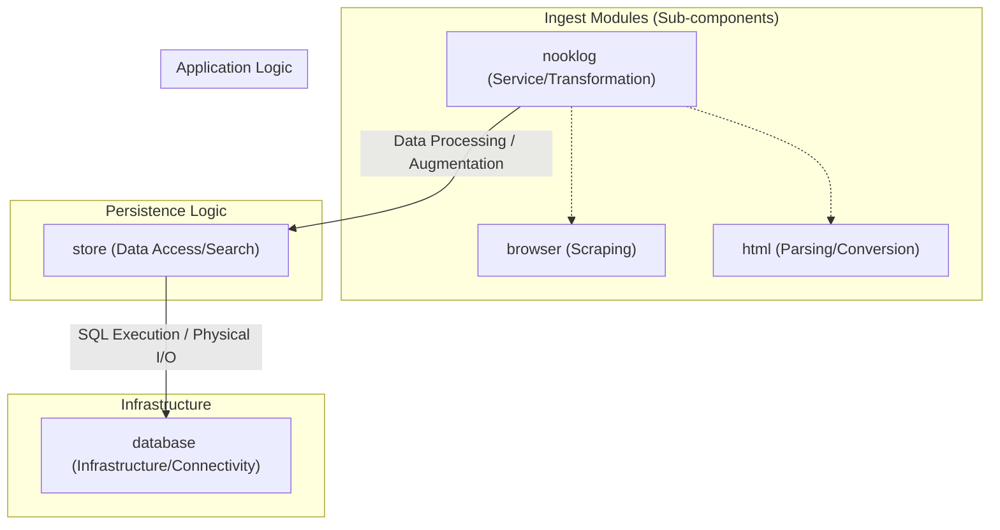

[🇯🇵](SKILL_ja.md)

# nooklog-maintenance

This skill provides guidelines for maintaining data integrity and safely executing large-scale transformations or database maintenance within the nooklog project.

> [!INFO]
> For retrieving or searching small amounts of data, you can also use the OpenAPI. Check `/openapi.html` on the running server.
> URL or tag corrections on the edit screen can be patched using Greasemonkey. See `tool/userjs/*.js`.

## Core Maintenance Policies

- **Safety Shutdown**: For safety, ensure that the running Nooklog instance is shut down before performing maintenance.
- **Safety First (Backups)**: Before performing destructive operations (bulk transformations, deletions, etc.), always create a physical copy (backup) of the database files (e.g., `nooklog.db.bak`) to ensure a reliable rollback point.
- **Fail Fast Principle**: Design maintenance scripts to log errors or terminate immediately upon encountering irregular data, rather than silently ignoring anomalies.
- **Proper Resource Management**: Always call `nooklog.dispose()` at the end of a script to safely close database connections and release resources.

## Maintenance Architecture

Nooklog treats LibSQL (SQLite) as the single source of truth. When performing maintenance, consider the following three-tier architecture:

- **nooklog (Service/Transformation Layer)**
  - Responsible for HTML-to-Markdown conversion, property auto-completion, and tag cache synchronization.
  - This is the top-level layer where the application's business logic resides.
  - **New Record Efficiency**: Ideal for adding new records as it automatically populates missing properties via `db.createBookmark()`.
  - **Sub-components (ingest)**:
    - `ingest/browser`: Handles dynamic web page scraping using Playwright with the Stealth plugin.
    - `ingest/html`: Manages content extraction using Readability (removing headers/footers) and Markdown conversion via Turndown.
- **store (Data Access/Search Layer)**
  - Orchestrates FTS5 full-text search, vector search, hybrid search logic, and bulk save operations.
  - Manages data manipulation to maximize LibSQL performance.
- **database (Infrastructure/Connectivity Layer)**
  - Manages LibSQL client initialization, Turso connectivity, and table/index definitions.
  - Responsible for physical database lifecycle tasks like `VACUUM` and schema management.
  - **Extensibility**: Can be used directly to manage auxiliary maintenance tables outside the primary entities.

## Implementation Best Practices

Observe the following guidelines when creating or running maintenance scripts:

- **Choosing the Right Layer**
  - Use the `store` layer for simple updates to fields like memos, URLs, or tags for maximum performance.
  - Use the `nooklog` layer for operations requiring advanced features like Markdown conversion or summarization.
- **Optimizing Vector Embedding Costs**
  - For operations that do not change text content (e.g., URL normalization), use `store.save(bookmarks, { embed: false })` to skip vectorization, significantly reducing API costs and execution time.
- **Data Retrieval Safety**
  - Data retrieved via `db.client.execute` has `tags` and `meta` columns stored as strings. To avoid parsing errors or manual handling, prioritize using `store.query`, which returns these fields as parsed JSON objects.
- **Dynamic Configuration and Environment Variables**
  - To control the execution environment from a script, import `#server/core/config` and overwrite `env` values (e.g., `env['server.data.path']`) before calling `db.initialize()`.
  - Refer to `.env.sample` in the root directory for detailed definitions and possible values for each environment variable.
- **Custom Metadata Naming**: When adding your own data to the `meta` column (JSON object) of the `bookmark` table, always use a name starting with `_` (e.g., `_my_custom_field`).

## Included Maintenance Scripts (`scripts/`)

The following scripts are **samples** and should be customized to meet specific requirements.

- `backfill_content.mjs`
  - Purpose: Identifies records with missing `markdown` and fetches/converts content from the URL using Playwright.
  - Note: Records failure reasons in `meta._fetch_error` within the `meta` (JSON object) column of the `bookmark` table.
- `import_obsidian_clippings.mjs`
  - Purpose: Performs bulk import of Markdown clippings (e.g., from an Obsidian vault). Maps frontmatter fields (URL, tags, dates) to database columns.
  - Setup: Update the `CLIPPINGS_DIR` variable to point to your actual vault path.
- `normalize_github_urls.mjs`
  - Purpose: Clean up GitHub URLs by removing unnecessary query parameters (e.g., `?tab=...`) to ensure data consistency.
  - Optimization: Uses `embed: false` since the text content remains unchanged.
- `tag_video_bookmarks.mjs`
  - Purpose: Automatically applies the `video` tag to bookmarks from recognized video platforms (YouTube, Vimeo, etc.).

## Critical Warning

> [!IMPORTANT]
> Calling `nooklog.save()` triggers automatic Markdown re-chunking and vector embedding (via OpenAI-compatible APIs) by default. Exercise extreme caution regarding API costs and execution time when processing thousands of records.
