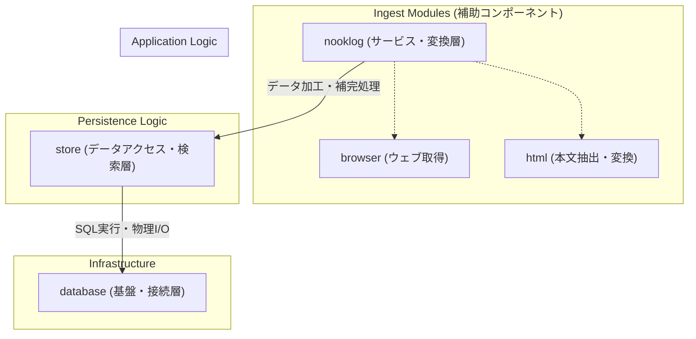

# nooklog-maintenance

このスキルは、nooklogプロジェクトのデータ整合性を維持し、大規模な一括変換やデータベースメンテナンスを安全に実行するためのガイドラインです。

## メンテナンスの基本方針

- **安全性の確保（バックアップ）**: 破壊的な操作（一括変換や削除など）を実行する前には、必ず `nooklog.db` などのデータベースファイルを物理コピー（`bak` の作成）し、ロールバック可能な状態を確保してください。
- **Fail Fast（即時失敗）原則**: メンテナンススクリプトは、不規則なデータに遭遇した際、異常を隠蔽せずにエラーを記録、または即時停止するように設計してください。
- **リソースの適切な管理**: 作業終了時には、必ず `nooklog.dispose()` を呼び出し、データベース接続を安全にクローズしてください。

## メンテナンス対象のアーキテクチャ

nooklogはLibSQL（SQLite）を信頼できる唯一のソースとして管理しています。メンテナンス時には以下の3つの層を切り分けて考慮してください。

- **nooklog (サービス・変換層)**
  - HTMLからMarkdownへの変換、プロパティの自動補完・新規追加、タグキャッシュの同期管理を担当します。
  - アプリケーションのビジネスロジックが集約される最上位の層です。
  - **新規作成の利便性**: 全てのプロパティが揃っていなくても、不足分が自動的に補完されるため、新規レコードの追加に非常に適しています。
  - **補助コンポーネント (ingest)**: 
    - `ingest/browser`: Playwrightを用いた動的ページの取得を担当します。Stealthプラグインにより確実なスクレイピングを実現します。
    - `ingest/html`: Readabilityによる本文抽出（不要なヘッダー・フッターの除去）と、TurdownによるMarkdown変換を司ります。ノイズの少ないクリーンな情報を生成する際に重要となります。
- **store (データアクセス・検索層)**
  - FTS5全文検索、ベクトル検索、ハイブリッド検索のロジック構築および一括保存処理を担当します。
  - LibSQLの性能を最大限に引き出すためのデータ操作を統括する層です。
- **database (基盤・接続層)**
  - LibSQLクライアントの初期化、Turso接続、テーブル・インデックスの定義管理を担当します。
  - `VACUUM` による最適化や、基盤となるテーブル構成の管理を行う層です。
  - **拡張性**: メインの管理テーブル以外に、特定メンテナンス用途の臨時テーブルを追加作成する際などに直接利用可能です。

## 実装上のベストプラクティス

メンテナンススクリプトを作成・実行する際は、以下の指針を遵守してください。

- **更新処理の使い分け**
  - メモ、URL、タグなどの簡易的な修正であれば、`store` レイヤーを直接利用することで高速な処理が可能です。
  - Markdown変換や要約などの高度な機能が必要な場合は、`nooklog` レイヤーを利用してください。
- **ベクトル埋め込みコストの最適化**
  - テキスト内容に変更がない場合（URLの正規化のみ等）は、`store.save(bookmarks, { embed: false })` を指定することで、ベクトル埋め込みをスキップし、処理を大幅に高速化できます。
- **データ取得の安全性**
  - `db.client.execute` で取得したブックマークデータは、`tags` や `meta` カラムがパースされていない「文字列」のままです。誤操作のリスクを低減するため、原則として JSON がオブジェクトとしてパースされる `store.query` を使用してください。
- **一時的な設定変更と環境変数**
  - スクリプトから実行環境を制御する場合、`#server/core/config` をインポートし、`db.initialize()` を実行する前に `env['server.data.path']` や `env['database.turso.url']` を上書きすることで、動的な設定変更が可能です。
  - 各環境変数の詳細な意味や設定値については、ルートディレクトリに配置されている `.env.sample` を参照し、正確な構成を確認してください。

## 付属スクリプト (`scripts/`) の解説

これらのスクリプトは**サンプル**です。実際の環境や要件に合わせて、コードを適宜修正して使用してください。

- `backfill_content.mjs`
  - 概要: `markdown` が未設定のレコードに対し、Playwright プロセスを通じてURLから最新のHTMLを取得・変換し、コンテンツを補完します。
  - 特記事項: 取得失敗時は、`bookmark` テーブルの `meta` カラム（JSON オブジェクト）内の `meta._fetch_error` にエラーコードが記録されます。
- `import_obsidian_clippings.mjs`
  - 概要: Obsidian 等で作成された Markdown 形式のクリップファイルを一括読み込みし、フロントメターの情報（URL、タグ、公開日等）をDBへマッピングしてインポートします。
  - 設定方法: スクリプト内の `CLIPPINGS_DIR` 変数を、自身の環境の Obsidian Vault パスへ書き換えて使用してください。
- `normalize_github_urls.mjs`
  - 概要: GitHubのURL内の不要なクエリパラメータ（`?tab=...` 等）を除去し、データの正規化を行います。
  - 特記事項: コンテンツの変更を伴わないため、ベクトル埋め込みをスキップする `embed: false` を活用しています。
- `tag_video_bookmarks.mjs`
  - 概要: 主要な動画プラットフォームのブックマークに対し、不足している `video` タグを自動的に補完します。

## 重要な注意点

> [!IMPORTANT]
> `nooklog.save()` を呼び出すと、デフォルトで Markdown の再チャンク化およびベクトル埋め込み（OpenAI互換APIのコール）が実行されます。数千件規模のデータに対して実行する場合は、APIコストおよび処理時間に十分に注意してください。
