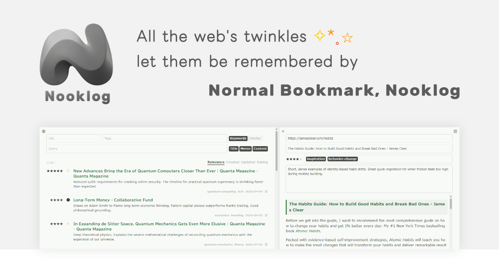
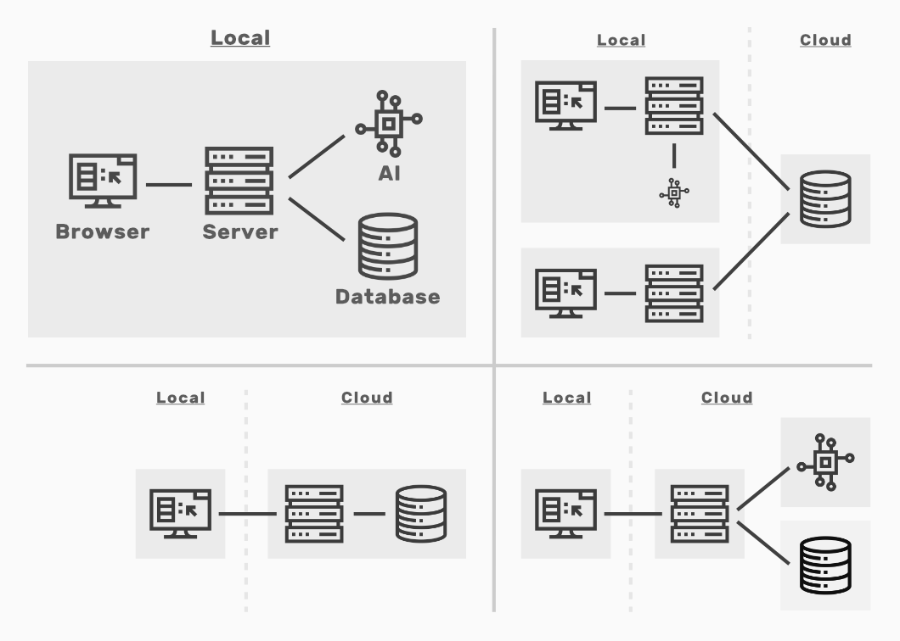
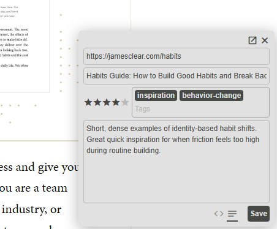
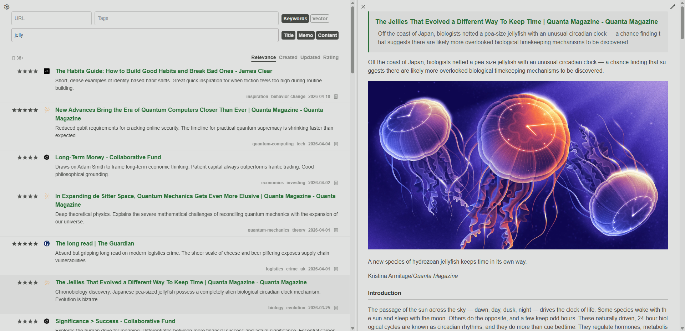
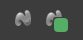
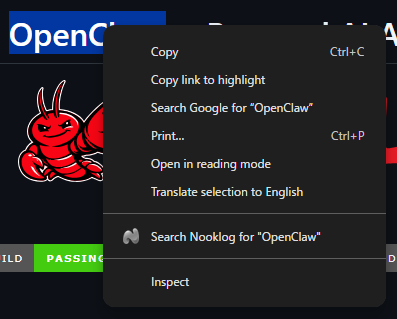

[🇺🇸](README.md)

# Normal Bookmark, Nooklog


## はじめに
ウェブを眺めていて、\
すてきなページが消えてしまった；；\
聞いたことがある言葉だけど思い出せない；；\
憶えておきたい情報だらけで ごちゃごちゃになってる＞＜ \
そんなことってありますよね...

ただ 目の前を流れ去っていってしまう情報🌊を 有意義で価値ある結晶💎に変えてみませんか？

めんどうな記憶は ぜんぶ ぽいぽい おまかせしちゃいましょう！\
ふつうのブックマーク Nooklogに✨

**[🚀 デモサイト(ベクトル検索なし/読み取り専用)](https://p01--nooklog-demo--dxnz489y9tm9.code.run/)**

## システム構成
サーバー / データベース / AI(オプション)　これらを 自由にローカルやクラウドに配置できます。\
Windows / Mac/ Linux　いろいろなプラットフォーム\
docker / pm2 / Electron(予定)　いろいろな方法でインストールできます。



- ローカルのみで スタンドアロンアプリとして かんたんに動かす
- データベースのみクラウド(Turso)に置き 自宅と職場でデータを共有する
- AIを使わず 全文検索のみを使って ローコストにクラウド(Northflank + Turso)に配備する
- 書き込みはPCからのみ行い 外出先からは クラウドの読み取り専用の軽量サーバー(Northflank + Turso)を使う
- 全てをクラウドに置き フルパワーで使う(お金に余裕があれば)

## 機能

> [!WARNING]\
> このソフトウェアは 現在 開発の初期段階にあります。\
> 多くの細かな不具合や 機能の欠損(未実装)が存在しています。\
> また データの破損に備え 細かなバックアップをお勧めします。

**⚙️ ブックマークの追加**\
とても小さなブックマーク編集画面が 素早く ページに埋め込み表示されます。 コンテンツを読みながら メモをとるのを 邪魔しません。\
賢いタグ補完と Ctrl + Enterによる保存　キーボードだけで 一瞬で処理を完了できます。\
ページ内の選択テキストをメモにコピーする機能を使えば 言葉をショッピングカートに入れるみたいに 検索や記憶に重要な部分だけを かんたんに集められます。



**⚙️ ブックマークの閲覧**\
ページ全体の内容を Markdown(構造化プレーンテキスト)として保存しています。(連続するページは自動読み込みブラウザ拡張（uAutoPagerizeなど）で繋げられます)\
リーダーモードを使って 集めたページを 連続して閲覧できます。(上下キー/Ctrl + J(K)/Alt + 上下)



**⚙️ ブックマークの確認**\
ブラウザ拡張のアイコンに ブックマーク済みの場合はバッジが表示されます。\
「このページ ブックマークしたっけ？」が すぐに分かります。\



コンテキストメニューから 選択テキストをNooklogで検索する機能も便利です。「HNSWっていう単語、 どっかで見たことある気がするぞ、、」が すぐに確認できます。



**⚙️ ブックマークの検索**\
全ての検索状態が URLに含まれています。 好きな検索条件のトップページにしたり よく使う検索を保存してスマートプレイリストのように使うのもよいでしょう。\
ブラウザの検索エンジンに「http://<your_nooklog_site>/?query=%s」を「n」として登録しておくと アドレスバーから「n claude code」のように素早く検索できます。

**⚙️ 全文検索**\
タイトルやメモだけでなく ページの本文全体のテキスト(Markdown)を検索できます。\
URLのみを対象にして 特定のサイトだけに絞って検索することもできます。(サイトのファビコンをクリックでクイック検索) 「最近ブックマークした Zennのページ」といった検索が 2クリックでできます。\
インデックスのためのテキスト分割は 単語と完全部分一致(unigram)から選べます。\
unigramは 中国/日本/韓国など スペース区切りではない言語や 「node-llama-cpp」のように記号を含む単語を 完全マッチで検索することができます。

**⚙️ ベクトル検索**\
「猫」「ネコ」「ねこ」のように 類似する概念を検索できます。\
テキストは Markdownの階層に従って 丁寧に細かく(コードブロックは大きく) 適切な粒度で切断されます。\
高速な近似最近傍探索と 正確な全件走査を 切り替えて併用することができます。

**⚙️ タグ入力/タグ検索**\
タグの補完方式として 「javascript」を「js」で検索するような スマートマッチ(飛び石マッチ)を使えます。\
検索結果のブックマークのタグをクリックすることで タグをクイック検索できます。 一つのブックマークから 関連するブックマークを 絞り込みながら 次々に見つけることができます。

**⚙️ レーティング**\
★★★☆☆ レート入力。 レート順の並び替え。\
不要な場合は非表示にできます。

**⚙️ コンテンツのバックフィル**\
URLとタイトルしかない古いブックマークの コンテンツを一括で取得し 検索や閲覧ができるようになります。\
Internet Archiveへのフォールバック機能もあり 消えてしまった素晴らしいコンテンツを復元することもできます。\
URLのみのリストをAPIで渡すような システム連携にも便利です。

**⚙️ インポート**\
以下の形式のブックマークをインポートできます。\
ブックマークHTML(Chrome/Firefox/はてな) / Pinboard / Linkwarden / Karakeep / Session Buddy / Tab Session Manager\
まずは 気軽に お使いのサービスのデータを Noologにインポートして どんなかんじに見えるのか ぜひ 試してください！

**⚙️ エクスポート**\
ブックマーク標準形式のHTMLでエクスポートできるので いつでも他のサービスへ移行することができます。\
完全なテキストを含む JSON形式でもエクスポートできます。 大切なデータが 取り出せなくなる不安は 全くありません ;-)\
コンテンツのテキスト(Markdown)だけを mdファイルとして zipにまとめてダウンロードすることもできます。\
エクスポート対象は 全体と 検索結果が選べます。 「特定のキーワード 特定のサイトだけの 全てのテキストファイルを抽出」 そんな使い方ができます。

**⚙️ libsql/Turso**\
Tursoは ローカルと全く同じように リモートにあるSQLiteデータベースにアクセスできる 素晴らしいサービスです。\
自宅と職場など 2つの場所から 一つのデータに安価に同期することができます。

**⚙️ Open API**\
[Open API(Scalar)](https://p01--nooklog-demo--dxnz489y9tm9.code.run/openapi.html)

**⚙️ バッチ変更**\
タグの一括置換や URLやメモの整形など データベースに対する一括処理は 以下を確認してください。 エージェントさんに読んでもらい スクリプトを生成してもらうと かんたんです。

**[📖 メンテナンスガイド](https://github.com/to/nooklog/blob/main/.apm/skills/nooklog-maintenance/SKILL_ja.md)**

**⚙️ user.js/ユーザースタイルによるパッチ**\
user.js(Tampermonkey/Greasemonkey)で 自由にに機能を追加できます。以下のサンプルスクリプトを 参考にしてください。\

- [Auto_Save.user.js](../tool/userjs/Auto_Save.user.js) (特定のサイトの閲覧を自動的にバックグラウンドで保存する。 ログ。)
- [Auto_Tagging.user.js](../tool/userjs/Auto_Tagging.user.js) (URLを元にタグを自動的に決定する。)
- [Auto_Summary.user.js](../tool/userjs/Auto_Summary.user.js) (LLMに要約を生成してもらう。)

ユーザースタイル()で見た目を お好みに合わせて自由に変更することもできます。

## インストール
簡単な起動や動作確認は以下です。

```sh
git clone https://github.com/to/nooklog.git
cd nooklog
npm install --omit=dev
npm start
```

dockerや pm2や クラウドへの配備など 詳細なインストール方法は以下を確認してください。

**[📖 インストールガイド](https://github.com/to/nooklog/blob/main/.apm/skills/nooklog-installation/SKILL_ja.md)**

### 技術スタック

| パート | 技術 |
| --- | --- |
| フロントエンド | Vanilla JS / Web Components |
| サーバー | Node.js / express |
| 本文抽出 | readability / turndown |
| チャンキング | unified / remark |
| AI | OepnAI(Ollama/...) |
| データベース | SQLite(libsql/Turso) |

## ライセンス
**PolyForm NonCommercial 1.0.0**\
クレジット表記は任意です。 記載しなくてもライセンス違反にはなりません。

> [!NOTE]\
> このソフトウェアは 無料ではありません。 なぜなら 私は とても お金を必要としているからです。\
> もし 10ドルを手にすることができたなら 私は 3日間 生き延びることができるでしょう。
>
> シンプルなソフトウェアですが みんなに気に入ってもらえるように 心を配り 丁寧に 人間とAIで仲良く作りました。\
> 無料でも制限は 全くありません。 数か月と 数年と 使い心地を ゆっくり試してみてください。\
> もし Nooklogが あなたの役に立ったなら　あなたの人生を 豊かなものにできたなら　ぜひ ご支援を検討してもらえると うれしいです✨

## ロードマップ/開発予定
- モバイル対応(PWA)
- Electron
- AI要約
- 高速化 / 軽量化
- Agentic Search / MCP / Skills / CLI
- 拡張検索 / HyDE
- PDF / 画像(OCR) / 動画(字幕)
- Markdown アップロード / Obsidian連携

## 関連プロダクト

### サービス
- [Pinboard](https://pinboard.in/)
- [Raindrop.io](https://raindrop.io/)

### プロジェクト
- [linkding](https://github.com/sissbruecker/linkding)
- [Karakeep](https://github.com/karakeep-app/karakeep)
- [Linkwarden](https://github.com/linkwarden/linkwarden)
- [Readeck](https://codeberg.org/readeck/readeck)
- [Hister](https://github.com/asciimoo/hister)
- [Archivist](https://github.com/tokuhirom/Archivist)
- [Yasumaro](https://github.com/armaniacs/yasumaro)
